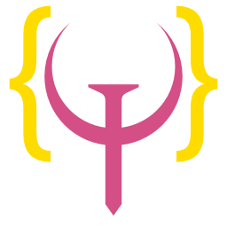

# Can-It-Code-Quake
A Project to code the Quake 3 algorithm in every language.

<https://matthewzenn.github.io/Can-It-Code-Quake/>

Let's find out how many languages can implement the Fast Inverse Square Root Algorithm. 

## If you would like to contribute:
 1. Fork the repository.
 2. Add your implementation to the ```Oats``` folder.
 3. Use the ```implementation``` tag in your PR.
 
 Passing data between languages or using math functions that weren't possible at the time is against the spirit of the challange. An implementation should try to folow the same process of the algorithm, as close as possible. Please do not edit the site code at this time. If you would, however, like to try something  more esoteric, and want to showcase a picture of it running on like an arduino or gameboy. Then feel free to add said image to the ```Assets``` folder, when uploading your code.

**Languages so far:**
- [x] x86 Assembly (needs testing)
- [ ] Bash
- [x] C/C++
- [x] C#
- [x] Dart
- [x] Fortran
- [x] Go
- [x] GDScript
- [ ] Haskell
- [x] Java
- [x] JavaScript
- [ ] Julia
- [ ] Kotlin
- [ ] Lua
- [ ] Minecraft (probably not possible)
- [ ] Nim
- [x] PHP
- [x] Python
- [x] Swift
- [x] Rust
- [ ] VBScript
- [ ] Vlang
- [x] Zig
- [ ] More Languages

## About the Algorithm
```c 
float Q_rsqrt(float number)
{
  long i;
  float x2, y;
  const float threehalfs = 1.5F;

  x2 = number * 0.5F;
  y  = number;
  i  = * ( long * ) &y; // evil floating point bit level hacking
  i  = 0x5f3759df - ( i >> 1 ); // what da heck?
  y  = * ( float * ) &i;
  y  = y * ( threehalfs - ( x2 * y * y ) ); // 1st iteration
  // y  = y * ( threehalfs - ( x2 * y * y ) ); // 2nd iteration, this can be removed

  return y;
}
```
